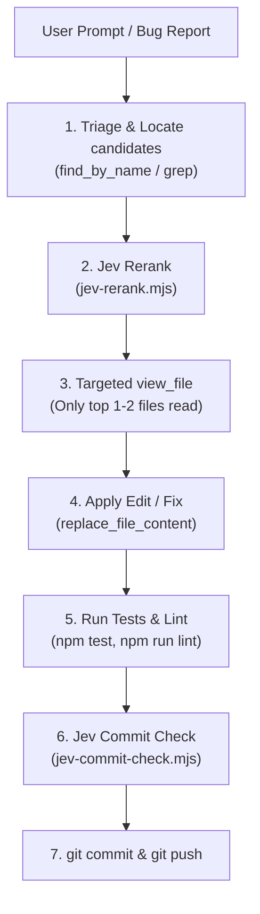

# Jev Accelerator for Antigravity (System One Agent Optimizer)

The **Jev Accelerator** skill enables Antigravity to delegate narrow, structured judgments to **TypeSafe Jev** (`jev-latest` / `jev-1.13.0`), a specialized System One model. Instead of relying on expensive LLM turns with huge context windows or spinning up heavy subagents for simple evaluations, Antigravity executes deterministic, sub-second System One calls.

---

## ⚡ Why Use Jev in Antigravity Workflows?

| Dimension | Standard Agent Workflow | Jev System One Workflow | Gain |
|---|---|---|:---:|
| **Context Consumption** | Reads 5–15 candidate files (`view_file`), adding 20k–60k tokens to context. | Jev selects the single target file via `Choice` in 1 call (~300 tokens). | **~95% token savings** |
| **Decision Latency** | Multi-turn reasoning loop (5s–15s). | Fast, single HTTP call (200ms–500ms). | **10x faster** |
| **Output Predictability** | Unstructured generative prose requiring regex/parsing. | Typed primitives with calibrated probabilities and confidence. | **Deterministic code flow** |
| **API Costs** | High input/output token usage on general-purpose frontier LLMs. | Minimal token footprint (300 in / 25 out). | **~12x cost reduction** |

---

## 🛠️ Built-in Helper Scripts

All scripts are located in [`scripts/`](./scripts/) and can be run directly via `run_command`:

### 1. Context Window Protection: File & Code Reranking
When `find_by_name` or `grep_search` returns multiple candidate files, **never read all of them into the context window**. Use Jev to pick the exact file:

```bash
node .agents/skills/jev-accelerator/scripts/jev-rerank.mjs --query "<task description>" <path1> <path2> <path3>...
```

**Example Output:**
```json
{
  "selected": "functions/src/modules/course/analytics.js",
  "confidence": 1
}
```
*Next action*: Use `view_file` **only** on the selected file, saving tens of thousands of context tokens.

---

### 2. Conventional Commit Pre-Flight Validator
The project rule (`GEMINI.md`) requires strict Conventional Commits (`<type>(<scope>): <description>`). Before committing, validate the message:

```bash
node .agents/skills/jev-accelerator/scripts/jev-commit-check.mjs "feat(auth): add session recovery on refresh"
```

**Output on Success (exit code 0):**
```json
{
  "valid": true,
  "probability": 0.97,
  "inferredType": "feat",
  "confidence": 0.99
}
```

**Output on Failure (exit code 1):**
```json
{
  "valid": false,
  "probability": 0.01,
  "inferredType": "invalid",
  "confidence": 0.97
}
```

---

### 3. General Fast Decision CLI (`jev-cli.mjs`)
Evaluate any arbitrary state against a typed question (`noul`, `choice`, or `score`):

#### A. Binary Condition (`noul`):
```bash
node .agents/skills/jev-accelerator/scripts/jev-cli.mjs \
  --state "Error: listen EADDRINUSE: address already in use :::3000" \
  --type noul \
  --instruction "Is this a port collision error rather than a code syntax bug?"
```
*Returns:* `{ "type": "noul", "noul": 0.99 }`

#### B. Categorical Choice (`choice`):
```bash
node .agents/skills/jev-accelerator/scripts/jev-cli.mjs \
  --state "TypeError: Cannot read properties of undefined (reading 'uid')" \
  --type choice \
  --instruction "What is the root failure category?" \
  --criteria '{"auth_missing": "Missing session or user context", "syntax": "Invalid JS syntax", "network": "Database connection drop"}'
```
*Returns:* `{ "type": "choice", "choice": "auth_missing", "confidence": 0.98 }`

#### C. Graded Dimension (`score`):
```bash
node .agents/skills/jev-accelerator/scripts/jev-cli.mjs \
  --state "Refactored dashboard components from 1000 lines to 400 lines with 100% test pass" \
  --type score \
  --instruction "Rate the stability and quality impact of this change" \
  --criteria '["Trivial or risky", "Moderate improvement", "High architectural improvement"]'
```
### 4. Technical & Educational Documentation Quality Auditor (`jev-doc-quality.mjs`)
Evaluate markdown guides, manuals, class materials, or API specifications for pedagogical clarity, technical completeness, and actionable examples:

```bash
node .agents/skills/jev-accelerator/scripts/jev-doc-quality.mjs <path-to-document.md>
```

**Example Output:**
```json
{
  "file": "README.md",
  "overallQualityIndex": 62,
  "qualityLevel": "BUENO",
  "scores": {
    "pedagogicalClarity": { "score": 0.75, "max": 3, "confidence": 0.52 },
    "technicalCompleteness": { "score": 2.07, "max": 3, "confidence": 0.82 }
  },
  "checks": {
    "hasRunnableExamples": true,
    "hasRunnableExamplesProbability": 0.98,
    "hasClearPrerequisites": true,
    "hasClearPrerequisitesProbability": 0.97
  },
  "targetAudience": {
    "level": "advanced",
    "confidence": 0.91
  }
}
```

### 5. Student C Submission & Git Repository Analyzer (`jev-c-analyzer.mjs`)
Analyzes student Git repositories containing C projects (`.c`, `.h`, `Makefile`) evaluating memory safety, dynamic memory leaks, modularity, build system, and commit progression:

```bash
node .agents/skills/jev-accelerator/scripts/jev-c-analyzer.mjs <path-to-c-repo>
```

**Example Output:**
```json
{
  "target": "/path/to/student_c_repo",
  "gradeIndex": 80,
  "assessment": "NOTABLE",
  "dimensions": {
    "memorySafety": {
      "score": 2.24,
      "max": 3,
      "confidence": 0.75,
      "staticAllocCount": 1,
      "staticFreeCount": 1,
      "unsafeFunctions": []
    },
    "errorHandling": { "score": 1.75, "max": 2, "confidence": 0.63 },
    "modularity": { "score": 2, "max": 2, "confidence": 1 },
    "buildSystem": { "hasProperMakefile": true, "probability": 0.97 },
    "gitAuthorshipProgression": { "classification": "monolithic_dump", "confidence": 0.98 }
  },
  "filesAnalyzed": ["Makefile", "calc.c", "calc.h", "main.c"]
}
```

*Composite Scoring in Code*:
$$\text{Grade} = (\text{MemorySafety} / 3 \times 35) + (\text{ErrorHandling} / 2 \times 25) + (\text{Modularity} / 2 \times 20) + (\text{BuildSystem} \times 10) + (\text{GitDiscipline})$$

---

## 📋 Standard Workflow for Antigravity

When executing pair-programming tasks, follow this optimized sequence:



1. **Discovery**: Run `find_by_name` or `grep_search` to find candidate paths.
2. **Filter with Jev**: Call `jev-rerank.mjs` to pick the single relevant file.
3. **Context Minimization**: Read only the selected file with `view_file`.
4. **Implement**: Make targeted edits with `replace_file_content`.
5. **Verify**: Run tests (`npm test`) and linter (`npm run lint`).
6. **Pre-commit Gate**: Check the commit message with `jev-commit-check.mjs`.
7. **Ship**: Execute git commit and push.

---

## 🔑 Credential Resolution

All scripts resolve `TYPESAFE_API_KEY` in this automatic order:
1. `process.env.TYPESAFE_API_KEY`
2. `.env.local` in project root
3. `~/.env` in user home directory

No manual export is required if `.env.local` or `~/.env` contains the key.
