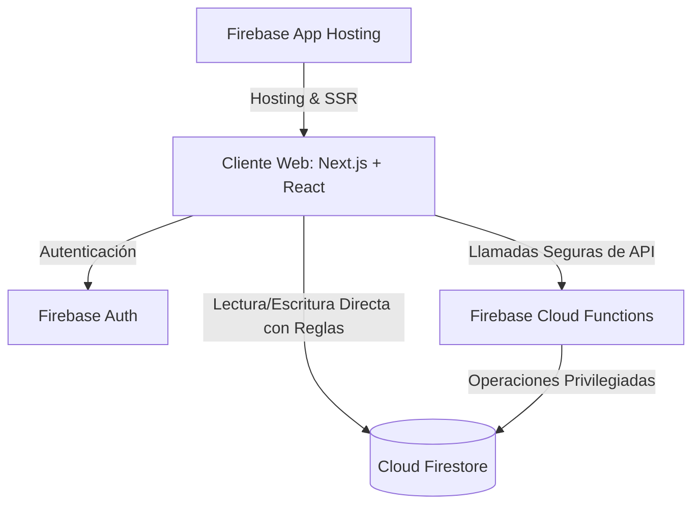

# Arquitectura del Sistema - Ninja Dojo

Este documento proporciona una visión detallada de los componentes del sistema, el modelo de seguridad, el diseño de la base de datos y la estructura de archivos de Ninja Dojo.

---

## 1. Vista General de Componentes

Ninja Dojo está diseñado bajo una arquitectura serverless híbrida compuesta por:



*   **Frontend (Next.js / React)**: SPA (Single Page Application) responsiva e interactiva con enrutamiento dinámico. Utiliza el Firebase Client SDK para escuchar actualizaciones en tiempo real (ej. notificaciones y cambios de estado de asistencia) y renderiza vistas personalizadas basadas en el rol del usuario actual.
*   **Servicio de Autenticación (Firebase Auth)**: Maneja el inicio de sesión federado (Google) y provee tokens JWT para identificar de forma segura a los usuarios en el frontend y backend.
*   **Base de Datos (Cloud Firestore)**: Base de datos NoSQL documental y en tiempo real. Configurada con reglas de seguridad estrictas para restringir lecturas y escrituras no autorizadas.
*   **Backend Serverless (Firebase Cloud Functions - Node.js 22)**: Provee una API HTTP centralizada (`api`) para realizar operaciones privilegiadas de administración (como reasignación de roles de usuario, generación de invitaciones y reportes consolidados) garantizando el cumplimiento de reglas de negocio difíciles de modelar con reglas puras de Firestore.
*   **Infraestructura de Hosting (Firebase App Hosting)**: Alojamiento optimizado con Server-Side Rendering (SSR) y CI/CD integrado directamente con repositorios de GitHub.

---

## 2. Modelo de Seguridad y Control de Acceso (RBAC)

El sistema implementa un modelo de Control de Acceso Basado en Roles (RBAC) con tres niveles jerárquicos:

1.  **Administrador (`admin`)**:
    *   Control total sobre todos los perfiles de usuario.
    *   Capacidad para aprobar/rechazar cuentas pendientes.
    *   Habilitado para crear/borrar materias e inscribir/desinscribir manualmente a docentes.
2.  **Profesor (`teacher`)**:
    *   Gestión completa de las materias en las que figura como docente (titular o ayudante).
    *   Habilitado para crear clases, regenerar cronogramas, redactar tareas y publicar avisos.
    *   Acceso a ver el listado de lecturas y acuses de recibo de avisos de sus estudiantes.
3.  **Estudiante (`student`)**:
    *   Lectura de materias en las que está inscripto.
    *   Visualización de clases y avisos de sus cursos correspondientes.
    *   Posibilidad de confirmar el acuse de recibo de avisos y realizar entregas de tareas asignadas.

### Implementación Técnica de Seguridad:
*   **Reglas de Firestore (`firestore.rules`)**:
    *   Validan que solo usuarios autenticados puedan leer sus propios perfiles.
    *   Aseguran que las lecturas de clases e inscripciones requieran que el usuario sea docente asignado o estudiante en el roster del curso correspondiente.
*   **Cloud Functions API**:
    *   Los endpoints críticos (ej: `/change-role`) decodifican el token de autenticación del llamador y verifican en Firestore que el perfil correspondiente posea el rol `admin` antes de proceder con el cambio en la base de datos.

---

## 3. Esquema de Base de Datos (Firestore)

El sistema organiza los datos en colecciones de documentos NoSQL. A continuación se detalla su esquema lógico:

### Colección: `profiles`
Almacena el perfil general del usuario al registrarse por primera vez.
```json
{
  "full_name": "Nombre Apellido",
  "email": "usuario@unrn.edu.ar",
  "role": "student | teacher | admin",
  "account_status": "pending | approved | rejected",
  "matricula_unrn": "UNRN-XXXXX"
}
```

### Colección: `courses`
Define una materia o cátedra dentro de la plataforma.
```json
{
  "name": "Nombre de la Materia",
  "github_org": "organizacion-github-catedra",
  "teacher_id": "teacher123",
  "created_at": "timestamp"
}
```

### Colección: `course_teachers`
Relación N-a-N que asigna profesores y ayudantes auxiliares a una cátedra.
```json
{
  "course_id": "course123",
  "teacher_id": "teacher123",
  "role": "titular | ayudante"
}
```

### Colección: `enrollments` y `course_roster`
Doble validación de inscripción de un estudiante a una cátedra para evitar desvanecimientos en consultas reactivas.
```json
{
  "course_id": "course123",
  "student_id": "student123",
  "enrolled_at": "timestamp"
}
```

### Colección: `classes`
Instancias individuales de clases correspondientes al cronograma del curso.
```json
{
  "course_id": "course123",
  "number": 1,
  "date": "2026-06-01",
  "time": "10:00",
  "topic": "Tema de la Clase",
  "description": "Texto markdown explicativo...",
  "type": "Teórica | Práctica | Feriado | Especial",
  "meet_url": "https://meet.google.com/xyz",
  "presentation_url": "https://docs.google.com/...",
  "recording_url": "https://youtube.com/watch?v=..."
}
```

### Colección: `announcements`
Avisos y comunicados enviados por los docentes de una cátedra.
```json
{
  "course_id": "course123",
  "title": "Título del Aviso",
  "content": "Cuerpo del aviso en texto plano o markdown...",
  "author_id": "teacher123",
  "author_name": "Kakashi Hatake",
  "created_at": "timestamp"
}
```

### Colección: `announcement_acks`
Registro de acuse de recibo de avisos completado por los estudiantes.
```json
{
  "announcement_id": "announcement123",
  "student_id": "student123",
  "student_name": "Naruto Uzumaki",
  "student_email": "naruto@jutsu.com",
  "confirmed_at": "timestamp"
}
```

### Colección: `class_comments`
Subcolección dentro de cada clase para almacenar comentarios del foro Q&A con soporte de soluciones del docente y reacciones.
```json
{
  "class_number": 1,
  "author_id": "student123",
  "author_name": "Naruto Uzumaki",
  "content": "Consulta sobre Git...",
  "created_at": "timestamp",
  "reactions": { "👍": ["student123"], "🎉": [] },
  "is_solution": true
}
```

### Colección: `attendance`
Registros de presentismo de los estudiantes.
```json
{
  "course_id": "course123",
  "student_id": "student123",
  "class_number": 1,
  "status": "present | absent | late",
  "recorded_at": "timestamp"
}
```

### Colección: `assignments`
Entregas y tareas académicas publicadas.
```json
{
  "course_id": "course123",
  "title": "Práctica Git",
  "description": "Consignas...",
  "template_repo": "owner/repo",
  "deadline": "timestamp",
  "created_at": "timestamp"
}
```

### Colección: `submissions`
Entregas de tareas hechas por los alumnos.
```json
{
  "assignment_id": "assign123",
  "student_id": "student123",
  "github_repo": "student/repo",
  "status": "submitted | graded",
  "grade": 9,
  "feedback": "Buen trabajo...",
  "submitted_at": "timestamp"
}
```

### Colección: `notifications`
Avisos, alertas de inactividad, respuestas de tutorías o advertencias de riesgo.
```json
{
  "student_id": "student123",
  "message": "Mensaje de alerta...",
  "link": "/dashboard/courses/course123",
  "read": false,
  "created_at": "timestamp"
}
```

### Colección: `study_groups`
Grupos de estudio formados por estudiantes con preferencias horarias de cursada.
```json
{
  "course_id": "course123",
  "name": "Los Ninjas del Código",
  "description": "Estudiamos algoritmos...",
  "schedule_pref": "Mañana | Tarde | Noche",
  "members": ["student123", "student456"],
  "created_by": "student123",
  "created_at": "timestamp"
}
```

### Colección: `tutors`
Perfiles postulados para tutorías entre pares en la cursada.
```json
{
  "course_id": "course123",
  "student_id": "student123",
  "name": "Sasuke Uchiha",
  "strong_topics": "Backend, TypeScript",
  "availability": "Viernes 18:00",
  "created_at": "timestamp"
}
```

### Colección: `tutoring_sessions`
Reservas e historial de mentorías programadas y confirmadas.
```json
{
  "course_id": "course123",
  "tutor_id": "student123",
  "student_id": "student456",
  "topic": "Dudas sobre Nest.js",
  "date_time": "2026-07-20T18:00:00",
  "status": "requested | confirmed | cancelled",
  "meet_url": "https://meet.google.com/abc-defg-hij",
  "created_at": "timestamp"
}
```

### Colección: `schedule_versions`
Snapshots de planificación de cronogramas.
```json
{
  "course_id": "course123",
  "name": "Versión Inicial",
  "class_instances": [ { "topic": "Tema...", "date": "..." } ],
  "created_by": "teacher123",
  "created_at": "timestamp"
}
```

### Colección: `backups`
Puntos de restauración global del sistema creados por los administradores.
```json
{
  "courses": [ { "id": "course123", "name": "..." } ],
  "assignments": [ { "id": "assign123", "title": "..." } ],
  "profiles": [ { "id": "user123", "full_name": "..." } ],
  "created_by": "admin123",
  "created_by_name": "Minato Namikaze",
  "created_at": "timestamp"
}
```

### Colección: `audit_logs`
Logs históricos detallando modificaciones sobre calificaciones (calificaciones inline en GitHub o trabajos prácticos).
```json
{
  "course_id": "course123",
  "submission_id": "sub123",
  "editor_id": "teacher123",
  "editor_name": "Kakashi Hatake",
  "diff": {
    "old": { "grade": 7, "feedback": "bueno" },
    "new": { "grade": 9, "feedback": "excelente refactor" }
  },
  "created_at": "timestamp"
}
```

---

## 4. Estructura de Directorios del Código Fuente

El repositorio está estructurado para independizar la lógica de despliegue del frontend de la del backend serverless:

```
├── .firebase/                  # Archivos temporales de despliegue de Firebase
├── docs/                       # Documentación técnica y de diagramas
│   ├── ARCHITECTURE.md         # (Este archivo) Estructura y arquitectura del sistema
│   ├── CASOS_DE_USO.md         # Escenarios detallados por rol de usuario
│   ├── DESIGN.md               # Tokens y paleta de colores de la UI
│   ├── DEVELOPMENT.md          # Estándares de desarrollo y commits
│   ├── NOMBRES.md              # Propuestas creativas de nombres de proyecto
│   ├── ROADMAP.md              # Futuras características y mejoras sugeridas
│   ├── TESTING.md              # Guía de pruebas manuales y seed
│   └── UML.md                  # Diagramas Mermaid (Casos de Uso, Secuencias)
├── functions/                  # Backend: Firebase Cloud Functions (Node.js 22)
│   ├── index.js                # Punto de entrada de la API HTTP Express
│   ├── seed.js                 # Script de carga de datos iniciales
│   └── package.json            # Dependencias del backend
├── public/                     # Recursos estáticos del frontend (imágenes, iconos)
├── src/                        # Frontend: Next.js + React
│   ├── app/                    # Rutas y páginas principales del sitio
│   │   ├── admin/              # Panel de administración de usuarios y cátedras
│   │   ├── courses/            # Vistas detalladas de cátedras y cronogramas
│   │   ├── layout.tsx          # Estructura HTML base y barra de navegación
│   │   └── page.tsx            # Página de inicio y panel del usuario (Dashboard)
├── firestore.rules             # Reglas de seguridad de acceso a base de datos
├── firestore.indexes.json      # Índices compuestos de base de datos
├── firebase.json               # Configuración de servicios de Firebase CLI
├── seed.sh                     # Script idempotente para poblar base de datos local o remota
└── package.json                # Dependencias del proyecto Next.js
```
