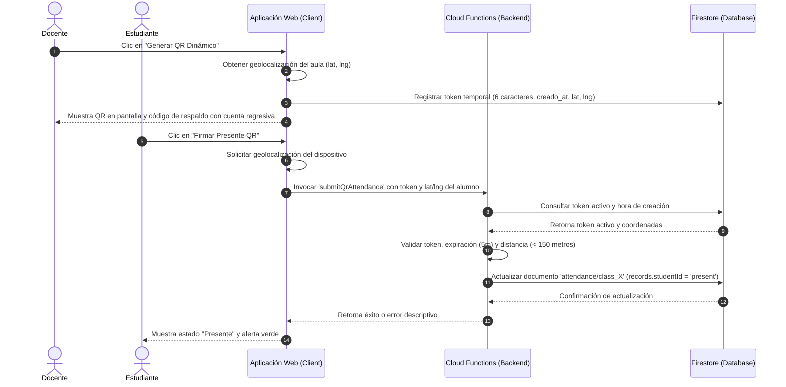
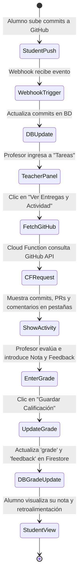

# Casos de Uso y Pruebas - Jutsu Classroom

Este documento detalla los casos de uso principales de la plataforma, divididos por el rol del usuario (Profesor y Estudiante). Para cada caso de uso se especifican las acciones necesarias para probarlo de principio a fin.

---

## 👨‍🏫 Casos de Uso del Profesor (Docente)

### 1. Autenticación y Creación de Cuenta
*   **Descripción:** El profesor inicia sesión en la plataforma usando su cuenta.
*   **Pasos para probar:**
    1. Ingresar a la URL principal de la plataforma.
    2. Hacer clic en "Entrar con Google" (o GitHub/Email).
    3. Completar el flujo de autenticación.
    4. Verificar que se redirige al panel principal (Dashboard).

### 2. Creación y Configuración Inicial de Cátedra
*   **Descripción:** El docente crea una nueva materia o cátedra.
*   **Pasos para probar:**
    1. En el panel principal, seleccionar "Crear Nueva Cátedra".
    2. Ingresar el nombre de la materia (ej. "Programación I").
    3. Ingresar a "Configuración" desde el menú de la cátedra creada.
    4. Cargar el texto de portada, fecha de inicio, duración en semanas, y el enlace de videollamada global (Meet).
    5. Hacer clic en "Guardar Configuración".

### 3. Gestión de Invitaciones (Alumnos y Profesores)
*   **Descripción:** El docente invita a sus estudiantes y colegas a unirse al curso.
*   **Pasos para probar:**
    1. Ir a la vista de "Configuración" de la cátedra.
    2. Ubicar la tarjeta "Enlaces de Invitación".
    3. **Para Alumnos:** Copiar el "Enlace para Estudiantes" y verificar que tenga el formato `/?enroll=CODIGO`.
    4. **Para Docentes:** Generar/Copiar el "Código de Invitación para Docentes".
    5. Abrir una ventana de incógnito, crear un nuevo usuario y pegar el enlace de estudiante para verificar que se inscriba automáticamente como alumno.

### 4. Definición de Horarios Genéricos
*   **Descripción:** El docente define las reglas generales de cursada semanal.
*   **Pasos para probar:**
    1. En "Configuración", ubicar la sección "Horarios Semanales Base".
    2. Seleccionar un Día (ej. Lunes) y una Hora (ej. 10:00).
    3. Elegir la Duración en bloques (ej. 2 horas = 4 bloques) y el Tipo (Teórica/Práctica).
    4. Hacer clic en "Agregar Horario" y guardar la configuración.

### 5. Generación y Edición del Cronograma Detallado
*   **Descripción:** A partir de los horarios, se instancian las clases exactas para todo el cuatrimestre, permitiendo modificaciones manuales.
*   **Pasos para probar:**
    1. Ir a la pestaña "Cronograma".
    2. Si no hay clases, hacer clic en "Regenerar Clases".
    3. Buscar una clase particular (ej. Clase 3) y marcar el estado especial como "Feriado / Sin Clase".
    4. Buscar otra clase y editar manualmente su fecha o su hora con los selectores habilitados.
    5. Completar el "Tema de la clase", añadir una "Descripción" (soporta Markdown), y colocar enlaces de material de presentación.
    6. Verificar que el enlace de Videollamada se pre-completó con el enlace global y editarlo si es necesario.

### 6. Vinculación con YouTube (Grabaciones)
*   **Descripción:** El docente conecta su canal de YouTube para enlazar sus grabaciones.
*   **Pasos para probar:**
    1. En el Cronograma, buscar una clase y presionar el botón `YT` junto al campo "Enlace a Grabación".
    2. Aceptar el popup de autenticación y conceder permisos de YouTube.
    3. En el prompt emergente, ver el listado de videos subidos recientes e ingresar el número correspondiente al video deseado.
    4. Aceptar la sugerencia para actualizar el título del video en YouTube con el nombre de la clase (ej. "Clase X: Tema").
    5. Verificar que el campo "Enlace a Grabación" se llenó automáticamente.

### 7. Gestión y Calificación de Entregas
*   **Descripción:** El docente revisa los trabajos y repositorios de los alumnos y les asigna notas.
*   **Pasos para probar:**
    1. Ir a la pestaña "Entregas".
    2. Visualizar la lista de trabajos entregados por los estudiantes (enlaces de repositorios GitHub, pull requests, etc.).
    3. Hacer clic en evaluar/calificar una entrega, ingresar el puntaje y una devolución en texto.
    4. Guardar y verificar que el estado cambie a corregido.

---

## 🎓 Casos de Uso del Estudiante

### 1. Inscripción Automática a un Curso
*   **Descripción:** El estudiante usa un enlace de invitación para entrar directamente a la cursada.
*   **Pasos para probar:**
    1. Ingresar mediante el enlace proporcionado por el profesor (`/?enroll=CODIGO`).
    2. Iniciar sesión o registrarse.
    3. Validar que al terminar el login, aparece un mensaje de éxito indicando que se ha inscripto al curso.
    4. Ver el curso listado en su Dashboard de Estudiante.

### 2. Consulta del Cronograma y Accesos
*   **Descripción:** El estudiante revisa la planificación, accede a los links de clase y materiales.
*   **Pasos para probar:**
    1. Ingresar al curso desde el dashboard y navegar al "Cronograma".
    2. Visualizar la cursada dividida ordenadamente por Semanas.
    3. Ver los temas, la descripción formateada (Markdown) y verificar si hay etiquetas especiales (ej. "REMOTA" o "FERIADO").
    4. Hacer clic en el enlace destacado de **"Videollamada"** para acceder a la clase en vivo.
    5. Hacer clic en los enlaces de **"Material"** y **"Grabación"** de clases pasadas.

### 3. Envío de Tareas y Entregas
*   **Descripción:** El estudiante presenta su trabajo (generalmente enlaces de código) al docente.
*   **Pasos para probar:**
    1. Ingresar a la sección "Mis Entregas" dentro del curso.
    2. Identificar un trabajo o tarea pendiente.
    3. Pegar la URL correspondiente (ej. un Pull Request de GitHub o enlace a repositorio).
    4. Hacer clic en "Entregar" y verificar que el estado pase a "Enviado / Pendiente de corrección".

### 4. Revisión de Calificaciones
*   **Descripción:** El estudiante revisa la nota y el feedback (devolución) de una tarea corregida.
*   **Pasos para probar:**
    1. Ingresar a la sección "Mis Entregas".
    2. Encontrar una entrega previamente corregida por el profesor.
    3. Visualizar la nota numérica o de estado, junto con los comentarios que haya dejado el docente.

### 5. Registro de Asistencia mediante Código QR y Geolocalización
*   **Descripción:** El estudiante firma su presencia en clases en tiempo real escaneando el QR o ingresando el código alfanumérico.
*   **Pasos para probar:**
    1. En el cronograma semanal de la materia, hacer clic en "📷 Firmar Presente QR".
    2. Conceder permisos de ubicación al navegador.
    3. Escribir el token de 6 caracteres del profesor y confirmar.
    4. Comprobar que el estado de asistencia cambia inmediatamente a "Presente".

### 6. Consulta de Actividad GitHub Personal
*   **Descripción:** El estudiante monitorea el progreso de sus commits, pull requests y comentarios de código sin salir de Jutsu Classroom.
*   **Pasos para probar:**
    1. En la pestaña "Tareas", abrir el bloque de la tarea correspondiente.
    2. Presionar "🔍 Ver Commits / Actividad".
    3. Inspeccionar el historial de commits, estado de PRs y comentarios del profesor en las pestañas respectivas.

---

## 📊 Diagramas de Procesos e Integraciones

### 1. Diagrama de Casos de Uso General
Muestra las interacciones de los distintos actores (Docentes y Estudiantes) con el sistema:

```mermaid
graph TD
    subgraph "Jutsu Classroom"
        UC1["Autenticación de Cuenta"]
        UC2["Gestionar Cátedra"]
        UC3["Generar Cronograma Semanal"]
        UC4["Generar Asistencia QR Dinámica"]
        UC5["Ver Actividad GitHub (Commits/PRs/Review)"]
        UC6["Calificar y Feedback Directo"]
        UC7["Inscripción mediante Enlace"]
        UC8["Consultar Cronograma y Recursos"]
        UC9["Firmar Asistencia QR con Geolocalización"]
        UC10["Aceptar y Entregar Tareas"]
        UC11["Ver Calificaciones y Actividad de Código"]
        UC12["Participar en Foro de Clase"]
    end

    Docente --> UC1
    Docente --> UC2
    Docente --> UC3
    Docente --> UC4
    Docente --> UC5
    Docente --> UC6
    Docente --> UC12

    Estudiante --> UC1
    Estudiante --> UC7
    Estudiante --> UC8
    Estudiante --> UC9
    Estudiante --> UC10
    Estudiante --> UC11
    Estudiante --> UC12
```

### 2. Diagrama de Secuencia: Asistencia QR Dinámica con GPS
Detalla el flujo de firma del presente por código dinámico y comprobación de cercanía geográfica:

### 3. Diagrama de Actividad: Monitoreo de GitHub y Calificación Inline
Ilustra el proceso de revisión y evaluación directa de repositorios académicos:

