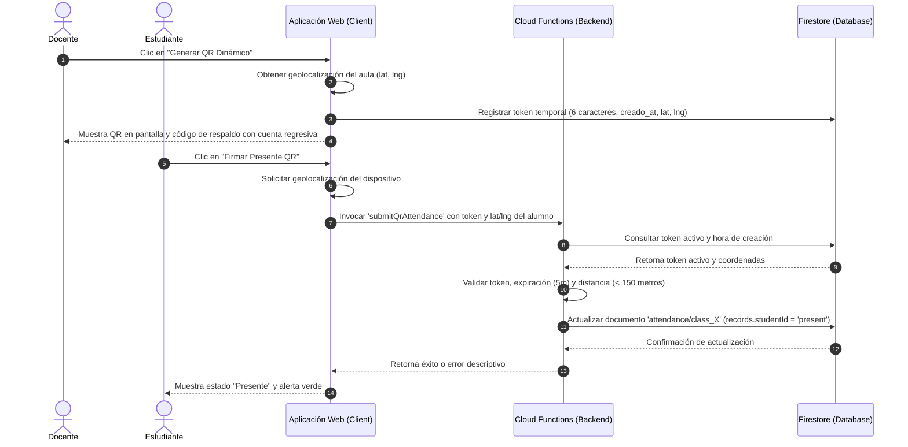
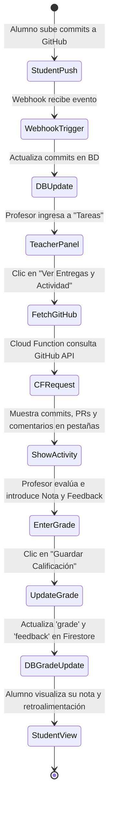
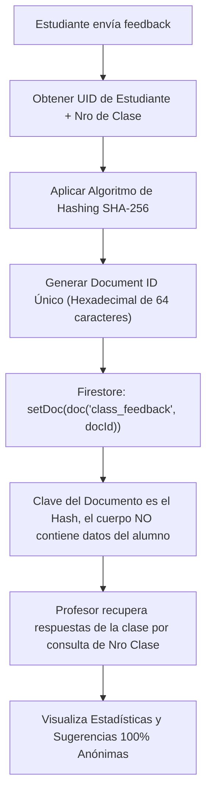
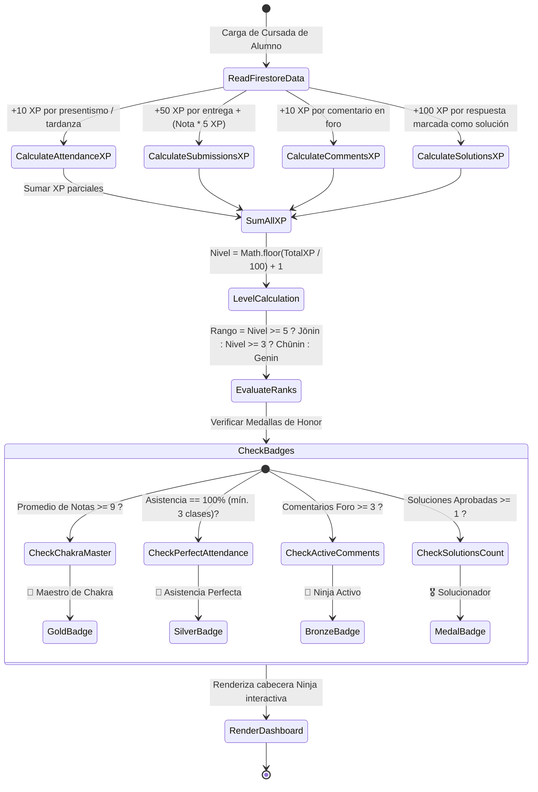

# Casos de Uso y Pruebas - Jutsu Classroom

Este documento detalla los casos de uso principales de la plataforma, divididos por el rol del usuario (Profesor y Estudiante). Para cada caso de uso se especifican las acciones necesarias para probarlo de principio a fin.

---

## 👨‍🏫 Casos de Uso del Profesor (Docente)

### 1. Autenticación y Creación de Cuenta
*   **Descripción:** El profesor inicia sesión en la plataforma usando su cuenta.
*   **Pasos para probar:**
    1. Ingresar a la URL principal de la plataforma.
    2. Hacer clic en "Entrar con Google" (o GitHub/Email).
    3. Completar el flujo de autenticación.
    4. Verificar que se redirige al panel principal (Dashboard).

### 2. Creación y Configuración Inicial de Cátedra
*   **Descripción:** El docente crea una nueva materia o cátedra.
*   **Pasos para probar:**
    1. En el panel principal, seleccionar "Crear Nueva Cátedra".
    2. Ingresar el nombre de la materia (ej. "Programación I").
    3. Ingresar a "Configuración" desde el menú de la cátedra creada.
    4. Cargar el texto de portada, fecha de inicio, duración en semanas, y el enlace de videollamada global (Meet).
    5. Hacer clic en "Guardar Configuración".

### 3. Gestión de Invitaciones (Alumnos y Profesores)
*   **Descripción:** El docente invita a sus estudiantes y colegas a unirse al curso.
*   **Pasos para probar:**
    1. Ir a la vista de "Configuración" de la cátedra.
    2. Ubicar la tarjeta "Enlaces de Invitación".
    3. **Para Alumnos:** Copiar el "Enlace para Estudiantes" y verificar que tenga el formato `/?enroll=CODIGO`.
    4. **Para Docentes:** Generar/Copiar el "Código de Invitación para Docentes".
    5. Abrir una ventana de incógnito, crear un nuevo usuario y pegar el enlace de estudiante para verificar que se inscriba automáticamente como alumno.

### 4. Definición de Horarios Genéricos
*   **Descripción:** El docente define las reglas generales de cursada semanal.
*   **Pasos para probar:**
    1. En "Configuración", ubicar la sección "Horarios Semanales Base".
    2. Seleccionar un Día (ej. Lunes) y una Hora (ej. 10:00).
    3. Elegir la Duración en bloques (ej. 2 horas = 4 bloques) y el Tipo (Teórica/Práctica).
    4. Hacer clic en "Agregar Horario" y guardar la configuración.

### 5. Generación y Edición del Cronograma Detallado
*   **Descripción:** A partir de los horarios, se instancian las clases exactas para todo el cuatrimestre, permitiendo modificaciones manuales.
*   **Pasos para probar:**
    1. Ir a la pestaña "Cronograma".
    2. Si no hay clases, hacer clic en "Regenerar Clases".
    3. Buscar una clase particular (ej. Clase 3) y marcar el estado especial como "Feriado / Sin Clase".
    4. Buscar otra clase y editar manualmente su fecha o su hora con los selectores habilitados.
    5. Completar el "Tema de la clase", añadir una "Descripción" (soporta Markdown), y colocar enlaces de material de presentación.
    6. Verificar que el enlace de Videollamada se pre-completó con el enlace global y editarlo si es necesario.

### 6. Vinculación con YouTube (Grabaciones)
*   **Descripción:** El docente conecta su canal de YouTube para enlazar sus grabaciones.
*   **Pasos para probar:**
    1. En el Cronograma, buscar una clase y presionar el botón `YT` junto al campo "Enlace a Grabación".
    2. Aceptar el popup de autenticación y conceder permisos de YouTube.
    3. En el prompt emergente, ver el listado de videos subidos recientes e ingresar el número correspondiente al video deseado.
    4. Aceptar la sugerencia para actualizar el título del video en YouTube con el nombre de la clase (ej. "Clase X: Tema").
    5. Verificar que el campo "Enlace a Grabación" se llenó automáticamente.

### 8. Monitoreo de Alumnos y Alertas Tempranas de Desempeño
*   **Descripción:** El docente supervisa el presentismo y entrega de tareas de todos los alumnos, visualizando alertas automáticas de riesgo de cursada.
*   **Pasos para probar:**
    1. Ir a la subpestaña "👥 Alumnos y Alertas" en el detalle de la cursada.
    2. Visualizar la lista de alumnos inscriptos con sus porcentajes de asistencia en tiempo real y el progreso de tareas.
    3. Verificar que si un alumno posee menos del 75% de asistencia (tras al menos 3 clases registradas), se muestra la etiqueta de alerta `⚠️ Asistencia Crítica`.
    4. Verificar que si un alumno tiene tareas vencidas sin entrega registrada, se muestra la etiqueta `⚠️ Tareas Atrasadas`.
    5. Verificar que el estado del alumno cambia a `EN RIESGO` si posee alguna alerta activa.

### 9. Sincronización e Integración con Google Sheets
*   **Descripción:** El docente descarga la matriz completa de progreso de la cursada para importarla en Google Sheets o Excel.
*   **Pasos para probar:**
    1. En la subpestaña "👥 Alumnos y Alertas", hacer clic en el botón "📊 Exportar Planilla (Sheets)".
    2. Verificar que se genera y descarga un archivo `.csv` con la codificación de compatibilidad universal.
    3. Abrir el archivo y validar que contiene columnas para Nombre, Email, Matrícula, las calificaciones de cada una de las tareas del curso, el promedio numérico general, el presentismo acumulado, las alertas activas y la condición final de cursada.

### 10. Consulta de Estadísticas de Feedback Anónimo
*   **Descripción:** El docente consulta el nivel de comprensión y la valoración cualitativa de cada clase dictada de forma 100% anónima.
*   **Pasos para probar:**
    1. Ir al "Cronograma" del curso.
    2. Presionar el botón `📊 Feedback Anónimo` en cualquier clase que ya haya sido dictada.
    3. Visualizar la valoración promedio por estrellas, total de alumnos participantes, distribución de nivel de entendimiento y sugerencias escritas anónimas.

### 11. Configuración de Co-Docencia y Responsables de Comisión
*   **Descripción:** El docente titular gestiona la distribución de responsabilidades por comisión entre el equipo de ayudantes y profesores de la cátedra.
*   **Pasos para probar:**
    1. Ir a la subpestaña "Ajustes Cátedra" (Settings).
    2. Ubicar la sección "Co-Docencia & Responsables de Comisión".
    3. Seleccionar un docente responsable para cada comisión ("Comisión A", "Comisión B", etc.) usando los selectores desplegables con la lista de ayudantes y profesores asignados.
    4. Hacer clic en "Guardar Configuración".

### 12. Administración y Filtrado de Comisiones en el Aula
*   **Descripción:** Los profesores y ayudantes filtran las vistas de alumnos, asistencia y entregas para concentrarse en su comisión a cargo, y asignan comisiones a los estudiantes.
*   **Pasos para probar:**
    1. Ir a la subpestaña "👥 Alumnos y Alertas".
    2. Asignar comisiones a los estudiantes mediante el selector desplegable de cada fila.
    3. Utilizar el selector general de "Comisión" para filtrar la tabla y ver solo los alumnos de una comisión específica.
    4. Navegar a "Cronograma" -> "📋 Control de Asistencia" de una clase, y verificar que también es posible filtrar el roster por comisión.
    5. Navegar a "Tareas" -> "Ver Entregas y Actividad" de cualquier tarea, y verificar que el listado de entregas y los estados se filtran dinámicamente por la comisión seleccionada.

### 13. Consulta de Métricas y Alertas en el Resumen Docente
*   **Descripción:** El docente o administrador visualiza la salud de la cursada a través del panel unificado de Resumen.
*   **Pasos para probar:**
    1. Seleccionar la cátedra en el listado principal de cursos.
    2. Validar que para docentes y administradores la página aterriza automáticamente en la subpestaña **📊 Resumen**.
    3. Verificar los contadores de "Correcciones Pendientes", "Alumnos en Riesgo" y "Entregas Totales".
    4. Comprobar que en la tabla "Alumnos que requieren Atención" se listan los perfiles en riesgo con su ratio de asistencia y badges de alerta correspondientes.

### 14. Flujo Directo de Corrección y Respuestas desde el Resumen
*   **Descripción:** El docente evalúa entregas y responde preguntas directamente desde la cola de tareas y foros pendientes del Resumen.
*   **Pasos para probar:**
    1. En la tarjeta "Cola de Corrección de Trabajos", buscar una entrega y presionar el botón "Evaluar". Verificar que el sistema cambia automáticamente al panel de tareas desplegando la entrega correspondiente.
    2. En la tarjeta "Consultas Recientes en Clases", buscar una pregunta de un foro y presionar "Responder en Foro". Verificar que la aplicación redirige al cronograma y expande el foro de consultas de la clase exacta.

---

## 🎓 Casos de Uso del Estudiante

### 1. Inscripción Automática a un Curso
*   **Descripción:** El estudiante usa un enlace de invitación para entrar directamente a la cursada.
*   **Pasos para probar:**
    1. Ingresar mediante el enlace proporcionado por el profesor (`/?enroll=CODIGO`).
    2. Iniciar sesión o registrarse.
    3. Validar que al terminar el login, aparece un mensaje de éxito indicando que se ha inscripto al curso.
    4. Ver el curso listado en su Dashboard de Estudiante.

### 2. Consulta del Cronograma y Accesos
*   **Descripción:** El estudiante revisa la planificación, accede a los links de clase y materiales.
*   **Pasos para probar:**
    1. Ingresar al curso desde el dashboard y navegar al "Cronograma".
    2. Visualizar la cursada dividida ordenadamente por Semanas.
    3. Ver los temas, la descripción formateada (Markdown) y verificar si hay etiquetas especiales (ej. "REMOTA" o "FERIADO").
    4. Hacer clic en el enlace destacado de **"Videollamada"** para acceder a la clase en vivo.
    5. Hacer clic en los enlaces de **"Material"** y **"Grabación"** de clases pasadas.

### 3. Envío de Tareas y Entregas
*   **Descripción:** El estudiante presenta su trabajo (generalmente enlaces de código) al docente.
*   **Pasos para probar:**
    1. Ingresar a la sección "Mis Entregas" dentro del curso.
    2. Identificar un trabajo o tarea pendiente.
    3. Pegar la URL correspondiente (ej. un Pull Request de GitHub o enlace a repositorio).
    4. Hacer clic en "Entregar" y verificar que el estado pase a "Enviado / Pendiente de corrección".

### 4. Revisión de Calificaciones
*   **Descripción:** El estudiante revisa la nota y el feedback (devolución) de una tarea corregida.
*   **Pasos para probar:**
    1. Ingresar a la sección "Mis Entregas".
    2. Encontrar una entrega previamente corregida por el profesor.
    3. Visualizar la nota numérica o de estado, junto con los comentarios que haya dejado el docente.

### 5. Registro de Asistencia mediante Código QR y Geolocalización
*   **Descripción:** El estudiante firma su presencia en clases en tiempo real escaneando el QR o ingresando el código alfanumérico.
*   **Pasos para probar:**
    1. En el cronograma semanal de la materia, hacer clic en "📷 Firmar Presente QR".
    2. Conceder permisos de ubicación al navegador.
    3. Escribir el token de 6 caracteres del profesor y confirmar.
    4. Comprobar que el estado de asistencia cambia inmediatamente a "Presente".

### 6. Consulta de Actividad GitHub Personal
*   **Descripción:** El estudiante monitorea el progreso de sus commits, pull requests y comentarios de código sin salir de Jutsu Classroom.
*   **Pasos para probar:**
    1. En la pestaña "Tareas", abrir el bloque de la tarea correspondiente.
    2. Presionar "🔍 Ver Commits / Actividad".
    3. Inspeccionar el historial de commits, estado de PRs y comentarios del profesor en las pestañas respectivas.

### 7. Consulta de Rango Ninja y Gamificación
*   **Descripción:** El estudiante visualiza su nivel de experiencia (XP), progreso de nivel y medallas de honor de cursada obtenidas según su desempeño.
*   **Pasos para probar:**
    1. Entrar al curso desde el dashboard de estudiante.
    2. Visualizar el bloque destacado de "Rango Ninja de Cursada" en la cabecera.
    3. Validar que muestra el nivel acumulado, la barra de progreso de XP y el rango (`Genin`, `Chūnin` o `Jōnin`).
    4. Verificar que las medallas de honor obtenidas (ej: `Maestro de Chakra` si el promedio es >= 9, `Asistencia Perfecta`, `Ninja Activo` o `Solucionador`) se muestran como badges ilustrativos.

### 8. Envío de Feedback Anónimo por Clase
*   **Descripción:** El estudiante evalúa la clase (de forma totalmente anónima) para brindar retroalimentación al docente sobre el ritmo y su comprensión.
*   **Pasos para probar:**
    1. En el "Cronograma", presionar el botón `✍️ Feedback Anónimo` de una clase ya dictada.
    2. Calificar la clase usando las estrellas (1-5), elegir su nivel de comprensión y opcionalmente escribir un comentario o sugerencia.
    3. Presionar "Enviar Feedback".
    4. Comprobar que si vuelve a abrir el formulario, sus respuestas anteriores aparecen precargadas (permitiendo modificarlas), pero su identidad no queda vinculada en el registro que ve el profesor.

---

## 👑 Casos de Uso del Administrador

### 1. Gestión de Roles y Aprobación de Usuarios
*   **Descripción:** El administrador gestiona los roles del sistema de todos los usuarios registrados y aprueba cuentas nuevas.
*   **Pasos para probar:**
    1. Iniciar sesión como administrador e ingresar a la pestaña "Usuarios" en la barra lateral (o ruta `/dashboard/users`).
    2. Utilizar el cuadro de búsqueda para filtrar la lista por nombre, email o matrícula.
    3. Cambiar el rol de un usuario usando el selector desplegable (ej. promover de Estudiante a Profesor).
    4. Aprobar a un usuario pendiente presionando el botón "Aprobar".

---

## 📊 Diagramas de Procesos e Integraciones

### 1. Diagrama de Casos de Uso General
Muestra las interacciones de los distintos actores (Docentes y Estudiantes) con el sistema:

```mermaid
graph TD
    subgraph "Jutsu Classroom"
        UC1["Autenticación de Cuenta"]
        UC2["Gestionar Cátedra"]
        UC3["Generar Cronograma Semanal"]
        UC4["Generar Asistencia QR Dinámica"]
        UC5["Ver Actividad GitHub (Commits/PRs/Review)"]
        UC6["Calificar y Feedback Directo"]
        UC7["Inscripción mediante Enlace"]
        UC8["Consultar Cronograma y Recursos"]
        UC9["Firmar Asistencia QR con Geolocalización"]
        UC10["Aceptar y Entregar Tareas"]
        UC11["Ver Calificaciones y Actividad de Código"]
        UC12["Participar en Foro de Clase"]
    end

    Docente --> UC1
    Docente --> UC2
    Docente --> UC3
    Docente --> UC4
    Docente --> UC5
    Docente --> UC6
    Docente --> UC12

    Estudiante --> UC1
    Estudiante --> UC7
    Estudiante --> UC8
    Estudiante --> UC9
    Estudiante --> UC10
    Estudiante --> UC11
    Estudiante --> UC12
```

### 2. Diagrama de Secuencia: Asistencia QR Dinámica con GPS
Detalla el flujo de firma del presente por código dinámico y comprobación de cercanía geográfica:

### 3. Diagrama de Actividad: Monitoreo de GitHub y Calificación Inline
Ilustra el proceso de revisión y evaluación directa de repositorios académicos:

### 4. Diagrama de Flujo: Anonimización de Feedback mediante SHA-256 Hashing
Explica cómo el sistema impide duplicados de encuestas sin revelar la identidad del estudiante:

### 5. Diagrama de Actividad: Sistema de Gamificación Dinámica (Rango Ninja)
Muestra cómo se calcula el Rango y las Medallas del alumno en tiempo real sin escrituras adicionales en base de datos:

