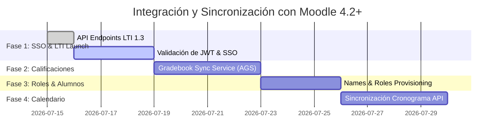

# Integración con Moodle (4.2+) - Guía y Hoja de Ruta

Este documento describe la hoja de ruta y la estrategia técnica para integrar **Ninja Dojo** con **Moodle (versión 4.2 o superior)** utilizando el estándar **LTI (Learning Tools Interoperability) 1.3** y una estructura de URIs REST unificadas.

---

## 1. URIs Dedicadas (Estructura REST)

La plataforma cuenta con rutas REST-compliant que resuelven dinámicamente el recurso solicitado y guían al usuario en su Dashboard interactivo:

*   **Tareas / Actividades**: `/dashboard/activities/[id]` (Redirige internamente a `/dashboard?assignmentId=[id]`)
*   **Cátedras / Cursos**: `/dashboard/courses/[id]` (Redirige internamente a `/dashboard?courseId=[id]`)
*   **Usuarios**: `/dashboard/users/[id]` (Redirige internamente a `/dashboard?userId=[id]`)

Esta arquitectura permite registrar cualquier enlace directo en Moodle (como un recurso URL o Herramienta Externa) de modo que al hacer clic se enfoque directamente al alumno en la tarea o curso asignado.

---

## 2. Hoja de Ruta (Roadmap) de Sincronización

### 📋 Hitos del Roadmap:

#### Fase 1: Enlaces Directos LTI 1.3 y Single Sign-On (SSO)
*   **Estado:** `INICIADO` (Endpoints API creados).
*   **Objetivo:** Permitir a alumnos ingresar a tareas grupales o individuales de Ninja Dojo con un clic desde Moodle sin re-autenticarse.
*   **Detalle:** 
    *   Moodle realiza un `POST` al endpoint `/api/lti/launch` enviando un token firmado con JWT.
    *   Ninja Dojo decodifica el token, identifica el correo del alumno, y lo redirecciona a su URI REST específica.

#### Fase 2: Sincronización Automática de Calificaciones (LTI AGS)
*   **Estado:** `PLANIFICADO`.
*   **Objetivo:** Exportar notas corregidas en Ninja Dojo directo al libro de calificaciones de Moodle.
*   **Detalle:** 
    *   Utilizar el servicio LTI Assignment and Grade Service (AGS).
    *   Cuando un docente califica una entrega desde la pestaña de tareas de Ninja Dojo, se dispara un webhook que actualiza la puntuación en Moodle mediante una petición HTTP `POST` a su API de Scores.

#### Fase 3: Sincronización de Inscripciones (LTI NRPS)
*   **Estado:** `PLANIFICADO`.
*   **Objetivo:** Mantener sincronizada la lista de alumnos sin necesidad de códigos manuales.
*   **Detalle:**
    *   Utilizar el servicio LTI Names and Role Provisioning Service (NRPS) para consultar los estudiantes de Moodle y poblar la cátedra en Firestore.

#### Fase 4: Sincronización del Calendario
*   **Estado:** `PLANIFICADO`.
*   **Objetivo:** Reflejar las clases planificadas y entregas de Ninja Dojo en el calendario de Moodle.
*   **Detalle:**
    *   Sincronizar eventos utilizando Moodle Web Services API (`core_calendar_create_calendar_events`) cada vez que se guarde una nueva clase en la VCS de Ninja Dojo.

---

## 3. Configuración del Endpoint LTI en Moodle

1.  **Registrar la Herramienta Externa:**
    *   Navegar a *Administración del sitio > Extensiones > Herramientas externas > Gestionar herramientas*.
    *   Elegir **Configurar herramienta manualmente** e introducir:
        *   **URL de la herramienta:** `https://dojo.com/api/lti/launch`
        *   **Versión LTI:** `LTI 1.3`
        *   **URL de inicio de sesión único (OIDC):** `https://dojo.com/api/lti/login`
        *   **Redirección URI:** `https://dojo.com/api/lti/launch`
        *   **Keyset URL:** `https://dojo.com/api/lti/jwks`
2.  **Agregar Enlace Directo a Tareas:**
    *   En un curso de Moodle, añadir una **Herramienta Externa**.
    *   Ingresar el enlace REST de la tarea como URL (ej. `https://dojo.com/dashboard/activities/[ID_TAREA]`). Moodle enviará automáticamente el ID de la tarea como parámetro personalizado en el token de lanzamiento.
