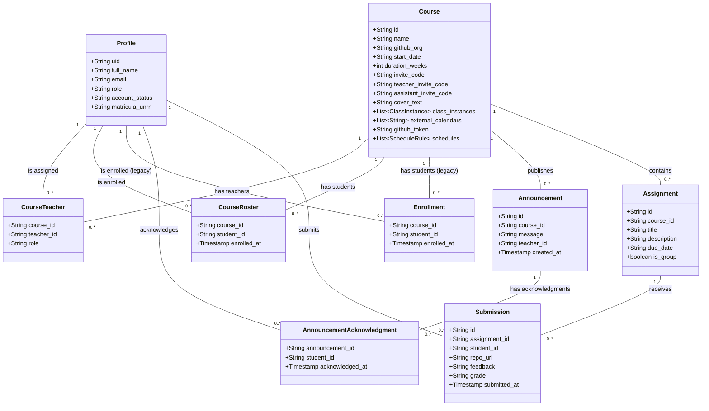
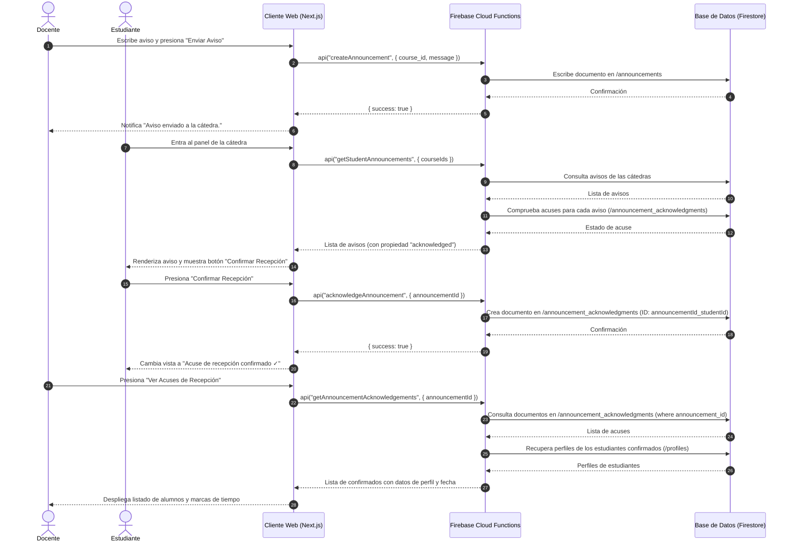

# Documentación UML - Jutsu Classroom

Este documento detalla la estructura lógica, los casos de uso y las interacciones dinámicas del sistema utilizando diagramas en formato **Mermaid**.

---

## 1. Diagrama de Casos de Uso del Sistema (Use Cases)

Representa las interacciones entre los diferentes actores de la plataforma (Administrador, Profesor, Ayudante, Estudiante) y sus respectivos casos de uso dentro del sistema.

```mermaid
graph TD
    %% Actors
    Admin((Administrador))
    Teacher((Profesor))
    Assistant((Ayudante de Cátedra))
    Student((Estudiante))

    %% Admin Use Cases
    UC_AdminUsers(Administrar Usuarios y Cambiar Roles)
    UC_AdminCourses(Crear y Administrar Cátedras)
    UC_AssignTeacher(Asignar Profesores/Ayudantes a Cátedras)
    UC_GlobalSettings(Configurar Parámetros Globales)

    Admin --> UC_AdminUsers
    Admin --> UC_AdminCourses
    Admin --> UC_AssignTeacher
    Admin --> UC_GlobalSettings

    %% Teacher Use Cases
    UC_CourseSettings(Configurar Cátedra: Fechas, Meet, Repo Base)
    UC_Schedule(Regenerar y Guardar Cronograma de Clases)
    UC_Announcements(Publicar Avisos Generales)
    UC_CheckAcks(Ver Acuses de Recepción de Avisos)
    UC_Assignments(Crear y Administrar Tareas)
    UC_Grades(Revisar y Calificar Entregas de Alumnos)

    Teacher --> UC_CourseSettings
    Teacher --> UC_Schedule
    Teacher --> UC_Announcements
    Teacher --> UC_CheckAcks
    Teacher --> UC_Assignments
    Teacher --> UC_Grades

    %% Assistant Use Cases
    Assistant --> UC_Schedule
    Assistant --> UC_Announcements
    Assistant --> UC_CheckAcks
    Assistant --> UC_Grades

    %% Student Use Cases
    UC_Enroll(Inscribirse a Cátedra por Código)
    UC_SubmitMatricula(Completar Registro con Matrícula UNRN)
    UC_ViewSchedule(Ver Cronograma, Asistencia y Materiales)
    UC_SubmitAssignment(Realizar Entregas de Tareas)
    UC_AckAnnouncement(Confirmar Recepción de Avisos)

    Student --> UC_Enroll
    Student --> UC_SubmitMatricula
    Student --> UC_ViewSchedule
    Student --> UC_SubmitAssignment
    Student --> UC_AckAnnouncement
```

---

## 2. Diagrama de Estructura de Datos (Class Diagram - Firestore ERD)

Muestra los modelos y colecciones almacenadas en Cloud Firestore, simulando un diagrama de clases / entidad-relación y definiendo las claves y asociaciones entre colecciones.

---

## 3. Diagrama de Secuencia: Flujo de Avisos con Acuse de Recepción

Describe el ciclo de vida y la interacción dinámica entre el **Docente**, el **Estudiante**, el **Frontend** y el **Backend (Cloud Functions + Firestore)** para la publicación de avisos y su correspondiente firma digital de lectura.

