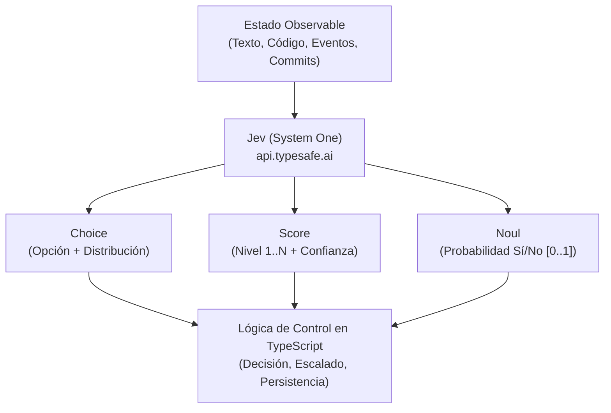
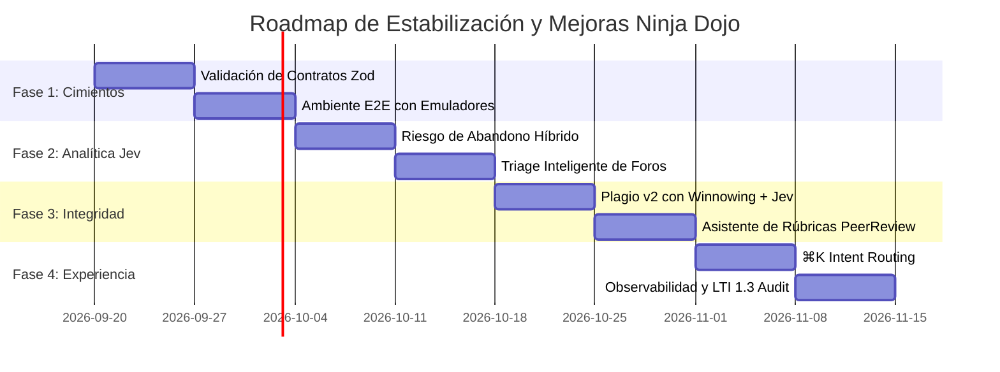

# Informe de Diagnóstico, Estado Actual y Roadmap de Estabilización con TypeSafe (Jev)
**Proyecto**: Ninja Dojo (Jutsu Classroom)  
**Fecha de Emisión**: 19 de Septiembre de 2026  
**Tecnologías Clave**: Next.js 16 (App Router), React 19, TypeScript, Tailwind CSS 4, Firebase Functions v2, Firestore RBAC, TypeSafe AI (Jev / System One)

---

## 1. Resumen Ejecutivo y Diagnóstico Global

Ninja Dojo es una plataforma integral de gestión educativa y LMS para entornos técnicos que integra gamificación, seguimiento de entregas en GitHub, asistencia por geolocalización QR, integraciones LTI 1.3 con Moodle y analíticas predictivas de riesgo estudiantil.

Tras la integración del SDK de **TypeSafe (`@typesafe-ai/sdk`)** y la validación de credenciales activas para el modelo insignia **Jev (`jev-1.13.0`)**, este informe establece un diagnóstico del código base y diseña un **Roadmap de Estabilización y Mejoras**. El enfoque reemplaza heurísticas rígidas y decisiones frágiles por juicios tipados de **System One**, preservando el gobierno de flujo y las reglas de negocio estrictamente en código TypeScript.

---

## 2. Estado Verificado del Repositorio (Baseline de Salud)

Se ejecutaron las suites completas de verificación sobre la rama `main` con los siguientes resultados:

| Componente / Check | Comando de Verificación | Resultado Observado | Estado |
|---|---|---|:---:|
| **Compilación de Producción** | `npm run build` | 15 rutas compiladas sin fallas de bundle | ✅ PASS |
| **Chequeo de Tipos Estático** | `npx tsc --noEmit` | 0 errores en TypeScript 5 | ✅ PASS |
| **Linter Estático** | `npm run lint` | 0 advertencias / 0 errores en ESLint 9 | ✅ PASS |
| **Backend Unit Tests** | `cd functions && npm test` | 128 pruebas superadas en 14 suites Jest | ✅ PASS |
| **Reglas de Seguridad Firestore**| `npm run test:rules` | 23 escenarios de RBAC validados en emulador local | ✅ PASS |
| **Frontend Unit Tests** | `npm run test:unit` | 16 pruebas en 4 suites (`dates`, `env`, `cors`, `webhook`) | ✅ PASS |
| **Conectividad con Jev** | `https://api.typesafe.ai/v1/systemone` | `noul: 0.98`, tokens: 309 in / 25 out (`jev-1.13.0`) | ✅ PASS |

---

## 3. Análisis Arquitectónico por Dominios

### 3.1. Frontend y Experiencia de Usuario (`src/modules/` y `src/app/`)
* **Aspectos Positivos**:
  * La modularización del Dashboard redujo [`src/app/dashboard/page.tsx`](file:///home/mrtin/dev/gaula/src/app/dashboard/page.tsx) a menos de 500 líneas, delegando responsabilidades en 14 hooks de dominio (`useCourseDetail`, `useCourseRealtime`, `useAdminPanel`, etc.) y 7 componentes de layout.
  * Se corrigieron problemas de CLS en avatares mediante `next/image` y se optimizó la reactividad con `useDebounce`.
* **Oportunidades de Estabilización**:
  * Los modales secundarios carecen de trampa de foco unificada (`focus-trap`), lo que permite que el tabulado escape hacia el fondo de la página.
  * Existen pantallas de estado vacío (Empty States) planas en tareas y correcciones que no ofrecen guías de acción claras al usuario.

### 3.2. Backend y Cloud Functions (`functions/src/modules/`)
* **Aspectos Positivos**:
  * Separación modular limpia por dominios: `attendance`, `auth`, `calendar`, `course`, `github`, `integrations`, `mail`, `notifications`, `study_groups`, `system`, `tutoring`.
  * Middleware de autenticación Bearer JWT (`requireBearerUser`) y secrets de alta entropía (`crypto.randomBytes(32)`).
  * Rate limiting y mitigación contra ataques de fuerza bruta en webhooks de autograding (máximo 10 intentos fallidos por IP / 5 min).
* **Oportunidades de Estabilización**:
  * Las acciones invocables asumen la estructura del `payload` sin validación de esquema en tiempo de ejecución con bibliotecas como Zod.
  * La analítica de abandono escolar descansa en una función estática de penalización matemática (`computeRiskScore`) sin capacidad de ponderar factores cualitativos.

### 3.3. Integración con GitHub y Autograding
* **Aspectos Positivos**:
  * Webhook autenticado mediante verificación HMAC SHA-256 de firmas de GitHub.
  * Detección de plagio base v1 mediante huellas de $k$-gramas y coeficiente de similitud Jaccard ([`plagiarism/engine.js`](file:///home/mrtin/dev/gaula/functions/src/modules/github/plagiarism/engine.js)).
* **Oportunidades de Estabilización**:
  * El motor de plagio v1 compara exclusivamente coincidencias de caracteres normalizados, siendo susceptible a falsos positivos en código boilerplate o falsos negativos ante refactorizaciones semánticas.

---

## 4. Estrategia de Modernización con TypeSafe (Jev / System One)

La filosofía de **TypeSafe** propone utilizar modelos rápidos de decisión calibrada para alimentar la lógica de programación tradicional.



### 4.1. Mapeo de Juicios a Primitivas Jev

#### A. Alerta Temprana de Abandono (Composite Scoring)
* **Situación Actual**: Fórmula estática `(1 - asistencia) * 45 + pendientes * 35 + tardías * 10 + (sin_foro ? 10 : 0)`.
* **Solución TypeSafe**: El código mantiene los pesos de asistencia y plazos, pero añade dos juicios atómicos evaluados por Jev:
  1. `Score` sobre el esfuerzo y progresión técnica en los commits recientes.
  2. `Noul` sobre señales de frustración o desconexión en consultas de foros.
* **Beneficio**: Reduce falsos positivos en estudiantes con entregas atípicas pero alto compromiso técnico.

#### B. Detección de Plagio v2 (Verification Cascade)
* **Situación Actual**: $k$-gram hashing compara secuencias crudas.
* **Solución TypeSafe**: 
  1. **Nivel 1 (Heurística rápida en código)**: El algoritmo Winnowing filtra pares con similitud $> 60\%$.
  2. **Nivel 2 (Juicio de Jev)**: Se formula una pregunta `Choice` con opciones:
     * `BOILERPLATE_MATCH`: Similitud atribuible al esqueleto base o librerías estándar.
     * `LOGICAL_REWRITE`: Misma lógica y algoritmos estructurales con identificadores alterados.
     * `INDEPENDENT_SOLUTION`: Similitud circunstancial en soluciones idiomáticas.
  3. **Nivel 3 (Confidence Routing)**: Si la confianza del juicio es menor a 0.70, se enruta a revisión manual docente.

#### C. Triage y Enrutamiento en Foros Q&A
* **Situación Actual**: Foros tradicionales con destacado manual de respuestas ("Modo Stack Overflow").
* **Solución TypeSafe**:
  * `Noul`: ¿La duda planteada está respondida explícitamente en el programa o apuntes de clase?
  * `Choice`: Tag temático y módulo curricular correspondiente.
  * Si `Noul.probability > 0.80`, la plataforma sugiere automáticamente al estudiante el enlace a la sección de clase antes de publicar el hilo duplicado.

#### D. Paleta de Comandos ⌘K (Intent Routing)
* **Situación Actual**: Búsqueda por filtro de cadenas de texto estáticas en títulos de cursos y clases.
* **Solución TypeSafe**: Enrutar intenciones en lenguaje natural (ej. "quiero ver las notas de la práctica 2", "descargar asistencia de hoy") hacia acciones tipadas del frontend mediante `Choice`.

---

## 5. Roadmap de Mejoras y Estabilización



### Fase 1: Cimientos y Estabilización de Contratos (Semanas 1 y 2)
* **Foco**: Confiabilidad estructural y determinismo.
* **Tareas Clave**:
  * Implementar schemas Zod en todas las Cloud Functions invocables en [`functions/src/modules/`](file:///home/mrtin/dev/gaula/functions/src/modules/).
  * Configurar suite de pruebas E2E contra `firebase emulators:exec` (Auth, Firestore y Functions) para validar flujos completos de login, permisos y envío de tareas.
  * Unificar la gestión de modales con `useFocusTrap` y eventos `Escape`.
* **Criterio de Aceptación (DoD)**:
  * 100% de los endpoints validan entradas con Zod.
  * Pruebas E2E ejecutadas contra emuladores en CI.

### Fase 2: Analítica y Colaboración con Jev (Semanas 3 y 4)
* **Foco**: Reemplazo de heurísticas ciegas por Composite Scoring semántico.
* **Tareas Clave**:
  * Refactorizar [`functions/src/modules/course/analytics.js`](file:///home/mrtin/dev/gaula/functions/src/modules/course/analytics.js) para integrar el cliente de TypeSafe en `getDropoutRiskAnalysis`.
  * Añadir el chequeo semántico de preguntas de foros con respuesta automática condicional.
* **Criterio de Aceptación (DoD)**:
  * El dashboard docente visualiza el desglose de riesgo con factores de esfuerzo y consistencia semántica.
  * Tiempo promedio de respuesta de evaluación inferior a 400ms.

### Fase 3: Integridad de Código y Rúbricas de Evaluación (Semanas 5 y 6)
* **Foco**: Evaluación técnica y prevención de plagio.
* **Tareas Clave**:
  * Implementar el algoritmo Winnowing en el motor de plagio y acoplar el clasificador `Choice` de Jev para pares sospechosos.
  * Dotar al módulo [`peerreview.js`](file:///home/mrtin/dev/gaula/functions/src/modules/github/peerreview.js) de precalificación por rúbrica asistida.
* **Criterio de Aceptación (DoD)**:
  * Reducción de falsos positivos de plagio en repositorios con plantillas compartidas.
  * Trazabilidad completa y auditoría de juicios emitidos por Jev.

### Fase 4: Experiencia Integral y Observabilidad (Semanas 7 y 8)
* **Foco**: Fluidez de usuario e interoperabilidad institucional.
* **Tareas Clave**:
  * Implementar Intent Routing en la paleta de comandos ⌘K para navegación por lenguaje natural.
  * Auditoría y verificación de grado de sincronización LTI 1.3 con Moodle 4.2+.
  * Dashboard de telemetría de tokens y latencias de inferencia de TypeSafe.
* **Criterio de Aceptación (DoD)**:
  * Comandos de la paleta ⌘K resueltos con confianza controlada.
  * Cero discrepancias en sincronización de calificaciones LTI.

---

## 6. Especificación de Implementación de Referencia

A continuación se detalla la integración modelo para el analizador de riesgo académico combinando determinismo y System One:

```typescript
import { TypeSafeClient, score, noul } from '@typesafe-ai/sdk';

const client = new TypeSafeClient({
  apiKey: process.env.TYPESAFE_API_KEY
});

export async function evaluateStudentEngagementSignals(data: {
  commitMessages: string[];
  recentForumQuestions: string[];
}) {
  const result = await client.evaluate({
    model: 'jev-latest',
    state: {
      commits: data.commitMessages,
      questions: data.recentForumQuestions
    },
    questions: {
      technical_progression: score({
        instructions: "Evalúa el progreso incremental y descriptivo en los mensajes de commit.",
        levels: {
          1: "Commits genéricos sin contexto ('update', 'fix', 'test').",
          2: "Mensajes descriptivos que reflejan resolución de problemas.",
          3: "Excelente convención, commits atómicos y pruebas referenciadas."
        }
      }),
      frustration_signal: noul({
        instructions: "Determina si el estudiante exhibe señales de bloqueo severo o frustración que requieran tutoría."
      })
    }
  });

  return {
    progressionScore: result.technical_progression.score,
    progressionConfidence: result.technical_progression.confidence,
    needsTutoring: result.frustration_signal.probability > 0.70
  };
}
```

---

## 7. Próximos Pasos Inmediatos

1. **Commit de la Documentación**: Registrar [`status.md`](file:///home/mrtin/dev/gaula/status.md) en el historial de Git siguiendo la convención semántica del proyecto (`docs(roadmap): create status and jev stabilization report`).
2. **Kickoff de Fase 1**: Comenzar con la implementación de validadores Zod en las acciones de administración y cursos en [`functions/src/modules/course/`](file:///home/mrtin/dev/gaula/functions/src/modules/course/).
